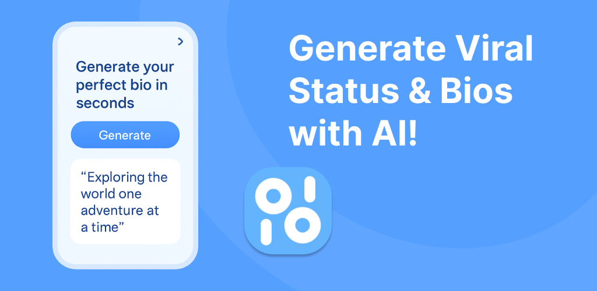

[](https://play.google.com/store/apps/details?id=com.aicaption)   

AICaption(Status & Bio AI Generator) - Create unique and personalized statuses, bios, and captions with AI Gemini.

### 📸 [Screenshot](./screenshots/1.png)

---

## 🚀 Features

- **AI-Powered Status Generator**  
  Simply enter a prompt or select an image — our AI instantly crafts a status that fits your mood, context, or vibe. Whether you're feeling witty, deep, romantic, or casual, we’ve got you covered.

- **Personalized Bio Creator**  
  Choose your writing style (funny, serious, inspirational, etc.), topic (love, career, personality, etc.), language, and preferred length — then let the AI generate a bio that truly reflects who you are.

- **Multi-Language Support**  
  Supports both **Vietnamese** (default) and **English**. Easily switch languages anytime from the settings for a personalized experience.

- **Modern Dark Mode UI**  
  Comes with a sleek, default dark theme that’s easy on the eyes and battery-friendly — perfect for day and night use.

- **Google Drive Cloud Sync**  
  Seamlessly back up and sync all your generated captions, statuses, and bios to **Google Drive**. Keep your data safe across devices — even after uninstalling or switching phones.

- **User-Friendly Interface**  
  Built with simplicity and ease-of-use in mind. The app features a clean and intuitive design with quick access to all core functionalities.

---

## 🛠️ Installation

```bash
git clone https://github.com/thanh-ph2021/AICaption.git
cd AICaption
npm install
```

## 🧠 Gemini API (`gemini-1.5-flash`)

Follow these steps to obtain your **Google API Key** for Gemini integration:

1. Visit [Google AI Studio](https://aistudio.google.com/).
2. Click **"Get API key"**.
3. Select **"Create API key"**, enter your project name, and generate the key.
4. Copy the generated API key and paste it into the `Google_API_KEY` variable in your `.env` file.
```bash
# .env
Google_API_KEY=YOUR_GOOGLE_API_KEY
```

## 🔥 Hot Update (`react-native-ota-hot-update`)

Follow these steps to get link download file `update.json`:

1. Go to [Firebase Console](https://console.firebase.google.com/).
2. Click **"New Project"** and follow the steps to create your project.
3. In the Firebase dashboard, go to **Storage** and click **Get Started** to enable it.
4. In your project root directory, run the following commands to prepare the update bundle:

```bash
npm run android-export
npm run compress-archive
```

5. Upload the file android/index.android.bundle.zip to Firebase Storage.
6. Create and upload the update.json file according to the react-native-ota-hot-update library format.
7. Get the public download URL of the update.json file and add it to your .env file under the API_VERSION variable:
```bash
# .env
API_VERSION=https://firebasestorage.googleapis.com/your-path-to/update.json
```

## 🏃‍♂️ Setting Up Google Drive API  

Follow these steps to enable **Google Drive API** and configure credentials for your app.  

### 🔹 1. Create a New Project  
1. Go to [Google Cloud Console](https://console.cloud.google.com/).  
2. Click **"New Project"** and enter your project details.  

### 🔹 2. Enable Google Drive API  
1. Navigate to **APIs & Services** > **Library**.  
2. Search for **Google Drive API**.  
3. Click **Enable** to activate the API for your project.  

### 🔹 3. Create OAuth Credentials  
1. Go to **APIs & Services** > **Credentials**.  
2. Click **Create Credentials** > **OAuth Client ID**.  
3. Choose **Application Type**:  
   - **Web Application**: Copy the **Client ID** and paste it into `webClientId` in file `.env`.
   - **Android**: Configure Android settings as required.
```bash
# .env
webClientId=yourWebClientId
```


## 🏃‍♂️ Run the App

```bash
npx react-native run-android
```

## 🛠️ Technologies Used

- React Native
- Redux
- Google Drive API
- Gemini API
- Hot Update
- AsyncStorage

## 📬 Contact
Email: thanh.ph2021@gmail.com

If you like AICaption, please consider **starring** the repository!
